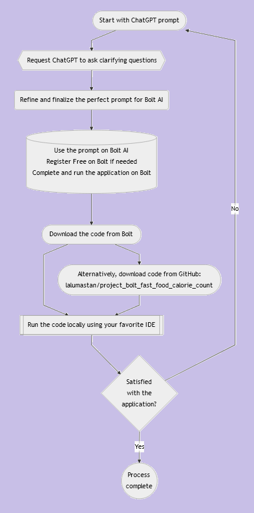
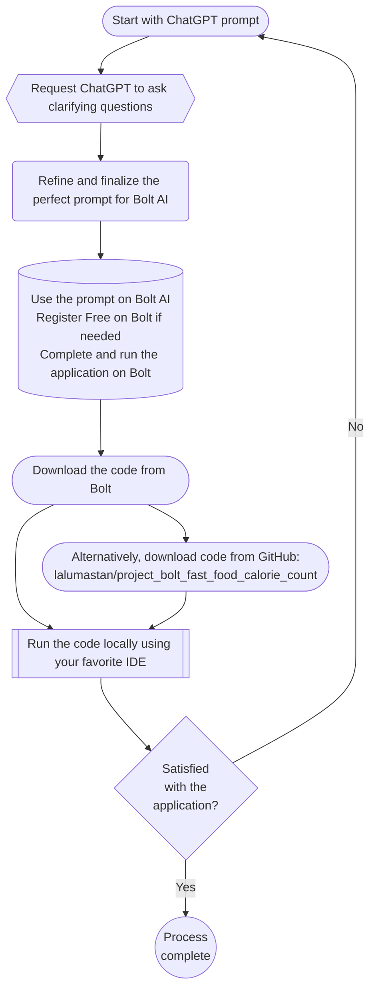

# Simple Fast Food Calorie Comparison Application (Generated by Bolt AI)

##  Workflow Summary

## Application Purpose:
Develop a web-based application to allow users to compare calorie counts across popular fast-food chains, including McDonald's, Burger King, Chipotle, Chick-fil-A, KFC, and Popeyes. The application should provide nutritional insights into meals and help users make informed dietary decisions.

---

## Detailed Requirements

### 1. **Project Setup**

#### Backend:
- Use **Spring Boot** for backend development.
- Configure a **MySQL database** to store food item data, nutritional information, and user preferences.
- Use RESTful APIs for communication between backend and frontend.

#### Frontend:
- Use **Angular** for the frontend interface.
- Design a responsive UI compatible with both desktop and mobile.
- Integrate Bootstrap or Material UI for a modern look.

---

### 2. **Database Design**

#### Tables:
- **Restaurants Table:** Fields for restaurant ID, name, and logo.
- **Menu Items Table:** Fields for item ID, restaurant ID (foreign key), name, calories, protein, fat, carbohydrates, and price.
- **User Preferences Table:** Fields for user ID, preferred calorie range, and favorite restaurants.
- **Comparisons Table:** Fields for comparison ID, user ID, selected restaurants, selected items, and comparison timestamp.

---

### 3. **Backend Development**

#### Core Functionalities:
1. **Food Data Management:**
   - CRUD operations for restaurants and menu items.
   - Admin-only endpoints for adding/updating menu data.

2. **User Management:**
   - User authentication using OAuth2 or JWT.
   - Endpoints for saving user preferences and history.

3. **Comparison Features:**
   - API to fetch menu items based on selected restaurants and filters.
   - API to generate comparison reports showing nutritional data side by side.

4. **Search and Filtering:**
   - Enable filtering by calorie range, price range, or nutritional values.

#### Integration:
- Integrate external APIs (e.g., USDA FoodData Central) to fetch updated nutritional info.

#### Testing:
- Provide detailed unit tests for all RESTful endpoints using JUnit.
- Ensure secure token validation for all user-specific endpoints.

---

### 4. **Frontend Development**

#### Key Features:
1. **Home Page:**
   - Dropdown to select restaurants.
   - Search bar for menu items.

2. **Comparison Page:**
   - Interactive table showing menu items from selected restaurants with calorie counts, macronutrients, and prices.
   - Sort and filter functionality.

3. **User Profile Page:**
   - Display saved preferences and comparison history.
   - Allow users to set calorie goals.

4. **Responsive Design:**
   - Use Angular Material to create a visually appealing, mobile-friendly UI.

#### Testing:
- Perform integration tests using tools like Jasmine and Karma.

---

### 5. **Additional Features**

#### Analytics:
- Dashboard for admin to track popular comparisons and frequently selected items.
- Provide users with insights into their calorie intake trends.

#### Sharing:
- Add social media sharing options for users to share comparisons.

#### Notifications:
- Send email notifications with personalized meal suggestions.

---

### 6. **Deployment and Maintenance**

#### Deployment:
- Host the backend on AWS or Heroku.
- Deploy the Angular frontend on platforms like Firebase or Netlify.

#### Maintenance:
- Set up CI/CD pipelines for automatic testing and deployment.
- Schedule regular database updates for nutritional data.

---

### Ethical Considerations
- Ensure data accuracy and disclaimers about nutritional information.
- Respect user privacy by adhering to GDPR and CCPA guidelines.
- Provide clear opt-in mechanisms for notifications and data storage.

---

### Final Notes
This application aims to help users make healthier choices while dining at fast-food chains by offering a straightforward comparison tool. Bolt AI should automate the setup for backend and frontend projects, database schema creation, and basic RESTful API structure as described above.

## Tutorials
